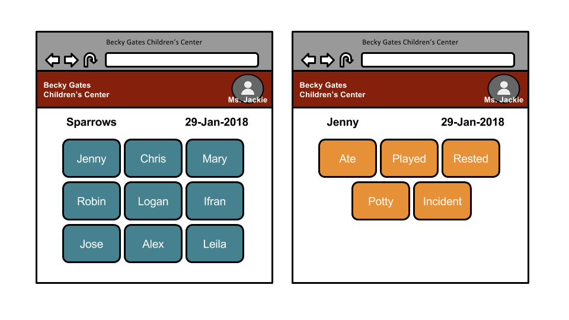
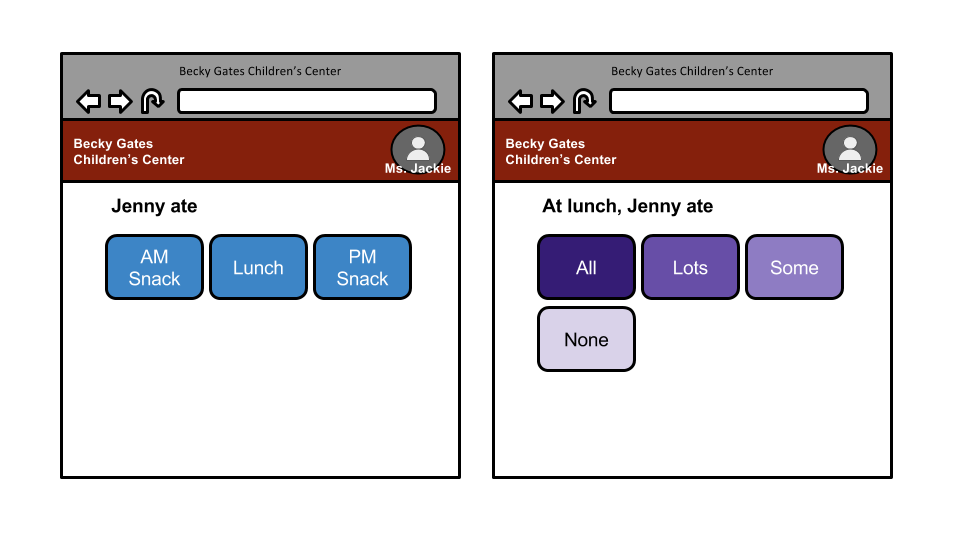
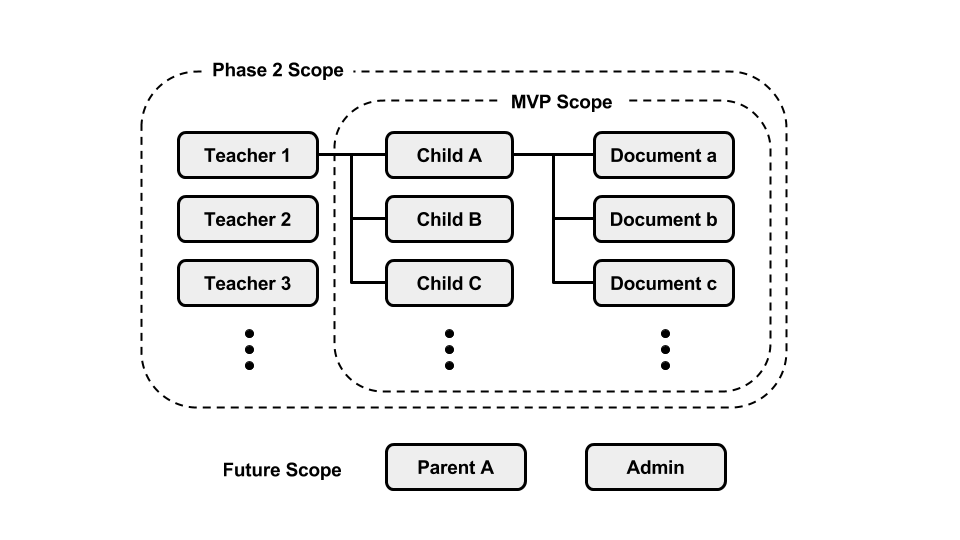

# BGCC Children's Daily Reports 
Simple web app to record children's daily activities for parents and teachers to utilize in promoting the child's growth
- Becky Gates Children's Center - Texas A&M University ([link](https://bgcc.tamu.edu/))
- Demo app is deployed here ([link](https://njang.github.io/bgccApp/))

## User Persona
1. Jackie Stewart is 51 year old teacher, currently working for the Becky Gates Children's Center of Texas A&M University. She is passionate about early childhood development and providing a nurturing and positive environment that cultivates curiosity and love of learning. 

1. Gloria Hernandez is 37 year old assistant professor in the department of electrical engineering at Texas A&M University. Her 3 year old son, Aiden is currently enrolled at the Becky Gates Children's Center. She drops him off in the morning around 9 AM and picks him up around 5 PM. She is excited about her son's growth stimulated by time spent at the BGCC with his friends and teachers.  

## User Story
* As Jackie, I want to log children's activities/observations, so that a daily report will be ready by the time their parents come to pick them up.
* As Jackie, I want to see children's growth progress, so that I can provide necessary support when & where it's needed.
* As Gloria, I want to see the daily report summarizing my son's day at the school, so that
* As Gloria, I want to see the monthly/quarterly trend in my son's eating habits, so that I can . 

## Wireframes

## Entity Relationship Diagram (ERD)

* Initial scope: Teacher > Child > Documents
  * Assume one teacher user, who has multiple children in his/her class. 
  * Each child has multiple documents associated, such as what they ate, how they played & rested, potty/diaper log and incident reports.
* Future scope: Parents, Admins
  * Expand to multiple teachers for a child.
  * Assign parent users to a child, as well as guardians/relatives.
  * Enable admin users who approves & monitors certain aspects of children's center daily operations (ie. incident reports)

## Minimum Viable Product (MVP)
* Database of all the children in one classroom
  * Displayed with the child's profile photo & name
  * Add/remove a child to/from class roster
  * Emergency button to make a call to, or otherwise alert the designated contact in case of accident/illness/etc.
* Documentation associated with each individual child
* Templates for different categories of observations
  * Eat (ate all, ate lots, ate some, ate none)
    * AM Snack
    * Lunch
    * PM Snack
  * Rest
    * Slept
    * Rested
    * Was active
    * Other (comments)
  * Play
    * Favorite activities
    * Comments
  * Potty
    * Time
    * Type
    * Effort
    * Supervised by
  * Incident report
    * Date/time/location
    * Teacher present & # of other children present
    * Description of injury/incident
    * What care/guidance was given?
    * Documented by

## Technology Stacks
* Front end: ([React.js](https://reactjs.org/)) & ([React router])(https://www.npmjs.com/package/react-router))
* Back end: ([Node.js](https://nodejs.org/)), ([Express.js](https://expressjs.com/)), ([Mongoose](http://mongoosejs.com/))

## Stretch Goals
* Capture photos of daily events: children playing, their artwork, etc.
* Link to meal plan & assess a child's preference & potential area of improvement
* Social media for the parents/family (limited access) 
* Signature/acknowledgement feature
* Speech-to-text entry option
* Voice memo feature

